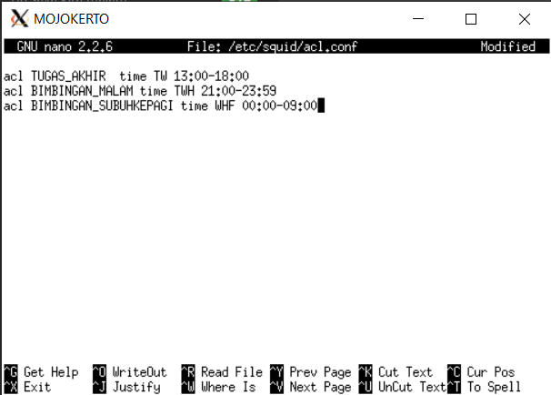

# Jarkom_Modul3_Lapres_D08
#### Soal 1
Untuk membuat topologi, maka dibuat file topo.sh di UML utama dengan konfigurasi berikut:


## DHCP
#### Soal 2
Untuk membuat UML SURABAYA sebagai relay, maka perlu diinstall isc-dhcp-relay, dengan perintah:
``` apt-get install isc-dhcp-relay ```

Setelah selesai install, dilakukan konfigurasi di /etc/default/isc-dhcp-relay.
Target server diatur menjadi server TUBAN, dan interface yang ditambahkan adalah semua interface yang menghubungken subnet2 ke SURABAYA, yaitu eth1, eth2, dan eth3:


Setelah dilakukan setup, operasi dipindah ke server TUBAN. Dimulai dengan menginstall isc-dhcp-server, dengan perintah:
``` apt-get install isc-dhcp-server ```

Setelah selesai install, dilakukan konfigurasi di /etc/default/isc-dhcp-server.
Interfaces diisi interface yang menghubungkan subnet tempat TUBAN dan relay SURABAYA.


Setelah dilakukan setup, dilakukan konfigurasi di /etc/dhcp/dhcpd.conf
Dlm file, ditambah subnet tempat TUBAN berada. Tidak perlu mengisi apapun.


#### Soal 3
Untuk mengatur dhcp untuk client, maka ditambahkan subnet2 client dlm /etc/dhcp/dhcpd.conf di server TUBAN


Untuk mengatur range di subnet 1, maka ditambahkan argumen berikut:
``` 
range 192.168.0.10 192.168.0.100;
range 192.168.0.110 192.168.0.200;
```

Setelah dilakukan konfigurasi, dilakukan restart pada server TUBAN:
``` service isc-dhcp-server restart ```

Setelah restart DHCP server, maka pindah ke client2 dlm subnet 1 (SIDOARJO & GRESIK) dan ganti konfigurasi /etc/network/interfaces
Comment/Hapus iface, address, gateway, dan netmask, lalu diganti dengan line berikut:
``` iface eth0 inet dhcp ```

Setelah diganti, dilakukan perintah berikut di UML Client:
``` service networking restart ```

untuk merestart networking pada Client

Restart dilakukan sebanyak 2 kali agar terlihat perubahan pada client.
Setelah restart, dilakukan cek IP client dengan perintah ifconfig pada tiap client.


#### Soal 4
Untuk mengatur range di subnet 3, maka ditambahkan argumen berikut:
``` range 192.168.1.50 192.168.1.70; ```

DHCP server restart dilakukan setelah konfigurasi seperti biasa

Setelah restart DHCP server, maka pindah ke client2 dlm subnet 3 (MADIUN & BANYUWANGI) dan ganti konfigurasi /etc/network/interfaces sebagaimana konfigurasi yang telah dilakukan di subnet 1.
Setelah konfigurasi interface, maka dilakukan restart sebagaimana langkah yang telah dilakukan juga di subnet 1.
Lalu dilakukan pengecekan IP pula dengan perintah ifconfig.


#### Soal 5
Untuk mengatur DNS Server client, maka ditambahkan argumen berikut dlm /etc/dhcp/dhcpd.conf pada tiap subnet:
``` option domain-name-servers 10.151.79.74, 202.46.129.2; ```

DHCP server restart dilakukan setelah konfigurasi seperti biasa

Setelah restart DHCP server, langsung dilakukan networking restart dlm client.
Setelah client restart, dapat dilakukan pengecekan pada /etc/resolv.conf pada tiap client untuk melihat apakah DNS server dikenali client, dengan perintah:
``` cat /etc/resolv.conf ```


#### Soal 6
Untuk mengatur batas waktu penggunaan IP untuk setiap client, maka dilakukan perintah berikut dlm /etc/dhcp/dhcpd.conf pada tiap subnet:
- Untuk subnet 1:
``` default-lease-time 300;
max-lease-time 300;
```

- Untuk subnet 3:
``` default-lease-time 600;
max-lease-time 600;
```

Waktu berupa satuan detik.
DHCP server restart dilakukan setelah konfigurasi seperti biasa

Setelah restart DHCP server, langsung dilakukan networking restart dlm client.
Terlihat pada saat restart, client2 pada subnet 1 dan subnet 3 memiliki renewal time yang berbeda:


## Proxy Server
#### Soal 7
Untuk membuat authentikasi ketika menggunakan proxy server, kita dapat mengikuti step-step berikut
- Install apache-utils pada UML MOJOKERTO dengan mengetikkan
```
apt-get install apache2-utils
```
- Buat User dan Password baru dengan mengetikkan
```
htpasswd -c /etc/squid/passwd userta_d08
```
```
Ketika meminta masukkan password ketikkan inipassw0rdta_d08
```
- Kemudian buat konfigurasi seperti gambar di bawah ini dengan mengetikkan
```
nano /etc/squid/squid.conf
```

- Restart squidnya
- Ubah pengaturan proxy dengan menggunakan IP MOJOKERTO dengan port 8080
- Coba buka ```monta.if.ac.id```

Hasil:


#### Soal 8
Untuk membuat pembatasan penggunaan internet untuk menerjakan TA dan waktu yang diperbolehkan hanya pada hari ```Selasa dan Rabu pukul 13:00-18:00``` dapat dilakukan dengan cara berikut ini
- Buat file baru bernama acl.conf di folder squid
```
nano /etc/squid/acl.conf
```
- Buat configurasi seperti gambar berikut

- Kemudian tambahkan configurasi pada squid.conf seperti gambar berikut


Hasil ketika proxy digunakan dan mengakses ```monta.if.ac.id``` pada waktu yang tidak ditentukan

Hasil ketika proxy digunakan dan mengakses ```monta.if.ac.id``` pada waktu yang ditentukan


#### Soal 9
Untuk membuat pembatasan penggunaan internet untuk waktu melakukan bimbingan dengan Bu Meguri pada waktu yang diperbolehkan hanya pada hari ```Selasa dan Kamis pukul 21:00-09:00 keesokan harinya/sampai Jumat 09:00``` dapat dilakukan dengan cara berikut ini
- Buka file acl.conf
```
nano /etc/squid/acl.conf
```
- Tambahkan configurasi seperti gambar berikut

- Kemudian tambahkan configurasi pada squid.conf seperti gambar berikut


Hasil ketika proxy digunakan dan mengakses ```monta.if.ac.id``` pada waktu yang tidak ditentukan

Hasil ketika proxy digunakan dan mengakses ```monta.if.ac.id``` pada waktu yang ditentukan


#### Soal 10
Untuk membuat agar setiap mengakses google.com langsung redirect ke monta.if.ac.id dapat dilakukan dengan menambahkan konfigurasi pada ```squid.conf``` seperti gambar berikut ini
- Buka file squid.conf dan tambahkan konfigurasi seperti gambar di bawah
 ```
 nano /etc/squid/squid.conf
 ```


#### Soal 11
Untuk menggubak ```Error Page Default Squidnya``` dapat dilakukan seperti berikut
- Masuk ke directory tempat menyimpan file error
```
cd /usr/share/squid/errors/en
```
- Rename file ERR_ACCESS_DENIED menjadi nama sesuai keinginan anda untuk menjadi backup atau bisa meremove file ERR_ACCESS_DENIEDnya
- Download file error yang diinginkan
```
wget 10.151.36.202/ERR_ACCESS_DENIED
```
- Coba buka ```monta.if.ac.id``` dengan menggunakan proxy dan pada waktu yang tidak diperbolehkan
HASIL


#### Soal 12
Untuk memebuat DNS agar dapat mengingat dan mempermudah pemakainya dapat dilakukan dengan cara seperti berikut
- Buat konfigurasi pada named.local.conf pada UML MALANG
```
 nano /etc/bind/named.conf.local
```
- Isiskan confikurasi janganlupa-ta.d08.pw seperti gambar dibawah ini

- Copykan file ```db.local``` pada ```/etc/bind``` kedalam folder jarkom dengan nama file janganlupa-ta.d08.pw
- Kemudian buka file ```janganlupa-ta.d08.pw```
```
nano /etc/bind/jarkom/janganlupa-ta.d08.pw
```
- Edit konfigurasi seperti gambar berikut dengan configurasi IP MOJOKERTO

- Restart bind9
```
service bind9 restart
```
- Ubah pengaturan proxy browser dengan menggunakan DNS yang telah kita buat yaitu janganlupa-ta.d08.pw dengan port 8080 dan coba jalankan serta buka monta.if.ac.id
